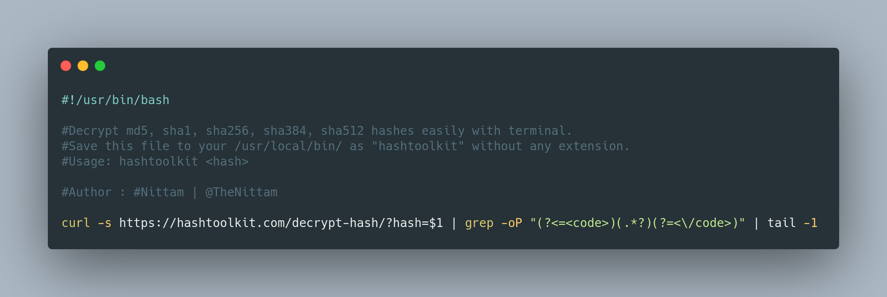
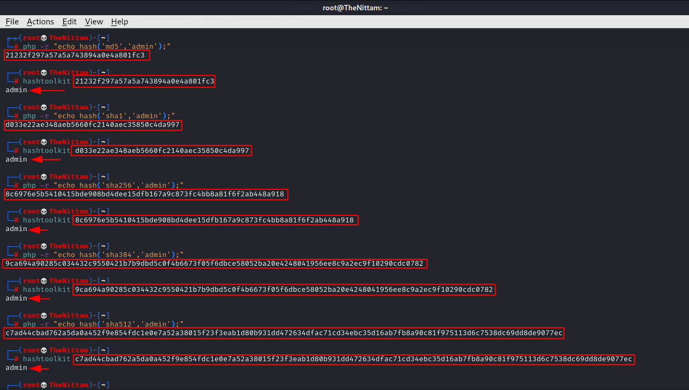

# HashToolKit (Unofficial) By [@TheNittam](https://twitter.com/TheNittam)

This tool is beneficial for those who do not want to leave the comfort of their terminal and still compare hashes by utilizing [**HashToolKit**](https://hashtoolkit.com/).

## Oneline Bash Script:

## Demo:

